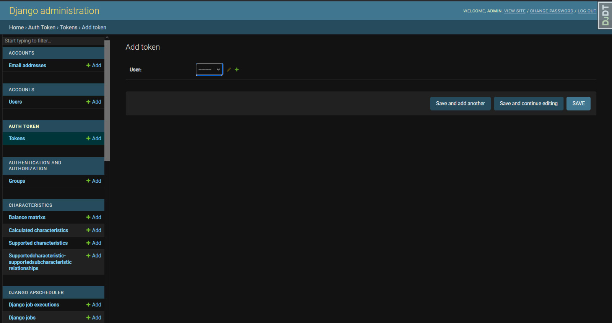
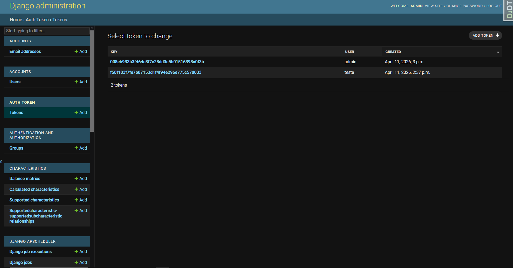
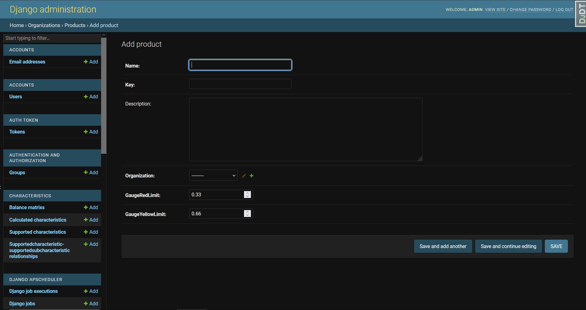
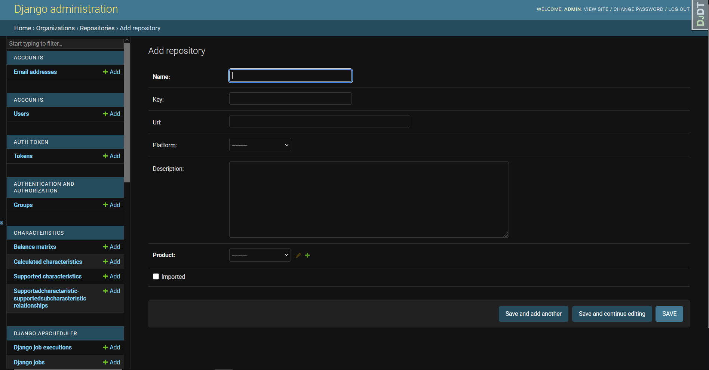
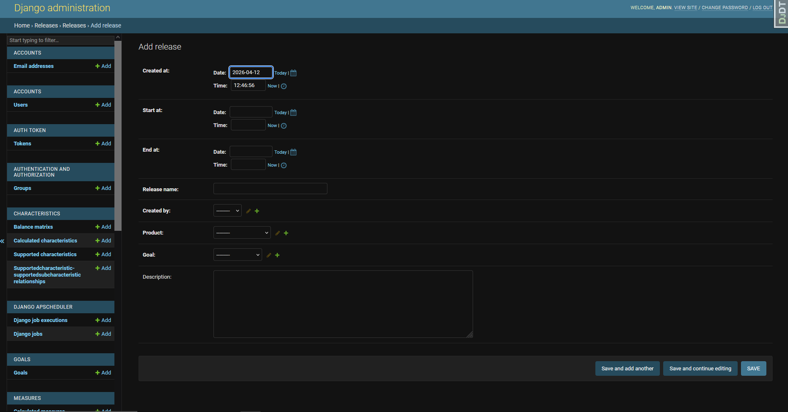

# Action

## Onboarding Local

Este guia descreve como configurar e executar a Action em ambiente local.

### Pré-requisitos

Antes de começar, certifique-se de ter as seguintes ferramentas instaladas:

| Ferramenta | Descrição |
|------------|-----------|
| [Docker](https://docs.docker.com/get-docker/) | Responsável pela containerização do projeto |
| [Node.js](https://nodejs.org/) | Necessário para compilação da Action |

### Serviços containerizados

O Docker será utilizado para orquestrar os seguintes serviços:

- **PostgreSQL** — Banco de dados relacional, exposto em `localhost:5432`
- **MeasureSoftGram Service** — API principal, exposta em `localhost:8080`
- **MeasureSoftGram Action** — Contém a biblioteca [Act](https://github.com/nektos/act), que permite executar pipelines do GitHub localmente. Este container só é iniciado quando um comando da Act é invocado.

> Para facilitar a execução das pipelines, foi criado um `Makefile` com os principais comandos — especialmente útil para quem não está familiarizado com a Act.

---

## Variáveis de Ambiente

As variáveis de ambiente devem ser configuradas dentro da pasta `env-vars/`, seguindo a estrutura de exemplo disponível em `env-vars-example/`.

> As variáveis do banco de dados e do Service **não precisam ser alteradas** — o projeto funciona corretamente com os valores padrão definidos em `env-vars-example/`.
>
> As variáveis da **Action**, no entanto, precisam ser preenchidas manualmente conforme descrito abaixo.

---

## Configurando e Executando a Action

### Estrutura da Pipeline

A criação de uma pipeline deve seguir o padrão descrito na página da Action. As seguintes variáveis de ambiente são obrigatórias:

```dotenv
GITHUB_TOKEN=SEU_GITHUB_TOKEN
SONAR_TOKEN=SEU_PROJETO_SONAR_TOKEN
MSGRAM_TOKEN=SEU_MSGRAM_SERVICE_TOKEN
MSGRAM_SERVICE_HOST=http://localhost:8080
```

---

### Obtendo o GitHub Token

Crie um **Personal Access Token (PAT)** seguindo as instruções oficiais na [documentação do GitHub](https://docs.github.com/pt/authentication/keeping-your-account-and-data-secure/creating-a-personal-access-token).

---

### Obtendo o Sonar Token

O `SONAR_TOKEN` corresponde ao **nome do projeto no SonarQube/SonarCloud**. Durante a execução da pipeline, as métricas serão buscadas diretamente a partir desse identificador.

---

### Obtendo o MeasureSoftGram Service Token

Após subir os containers com o Docker Compose, siga os passos abaixo para gerar um token de acesso:

1. Acesse o painel administrativo em [`http://localhost:8080/admin`](http://localhost:8080/admin)
2. Faça login com as credenciais padrão:
    - **Usuário:** `admin`
    - **Senha:** `admin`
3. No menu lateral, navegue até a seção **"Tokens"**
4. Crie um novo token conforme ilustrado nas imagens abaixo:

<center>
    <a>Imagem 1 - Criação do token de autenticação MSGram</a>
</center>



<center>
    <a>Imagem 2 - Hub de Tokens de autenticação MSGram</a>
</center>




---

### Criando o Projeto no MeasureSoftGram Service

#### Produto

O parâmetro **Product Name** deve ser cadastrado no Service conforme demonstrado abaixo:

<center>
    <a>Imagem 3 - Cadastrando Product</a>
</center>



> No caso do próprio MeasureSoftGram, o produto já se encontra previamente cadastrado, bastando apenas vincular o repositório e a release.

#### Repositório e Release

Também é necessário adicionar o repositório ao Service e vinculá-lo a uma release:

<center>
    <a>Imagem 4 - Crianção do repositório</a>
</center>



<center>
    <a>Imagem 5 - Criação de release</a>
</center>



---

## Executando as Pipelines

Com tudo configurado, utilize os comandos do `Makefile` para compilar e executar as pipelines:

```bash
# Compila a Action e sobe os containers via Docker Compose
make build

# Executa uma pipeline específica (substitua [nome-da-pipeline] pelo nome desejado)
make action-[nome-da-pipeline]
```

> **Exemplo:** `make action-msgram` executaria a pipeline chamada `msgram.yml`.


## Versionamento

| Versao | Data       | Descricao            | Autor                                    | Revisor |
|--------|------------|----------------------|------------------------------------------|---------|
| 1.0    | 12/04/2026 | Criação do documento | [João Antonio](https://github.com/i-JSS) |         |

