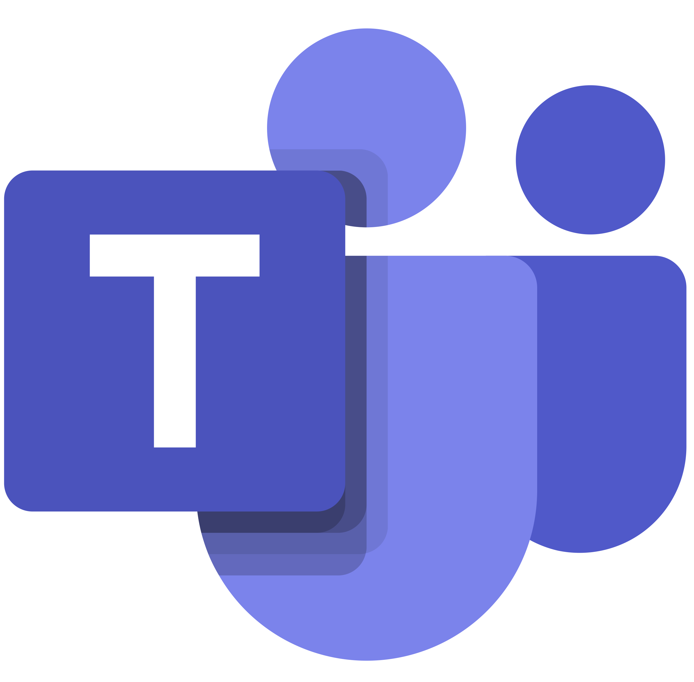

# Comunicação
## Agenda de trabalho e comunicação interna e externa

## 1. Introdução

O seguinte documento apresenta a forma em que a equipe se organizou e estruturou a comunicação, equipe de EPS em conjunto com o P.O e professor Hilmer. 

## 2. Ferramentas de comunicação e finalidade

<table>
    <tr>
        <td align="center">Ícone</td>
        <td align="center">Ferramenta</td>
        <td align="center">Descrição</td>
    </tr>
    <tr>
        <td></td>
        <td style="vertical-align: middle;">Discord</td>
        <td style="vertical-align: middle;">Ferramenta utilizada para comunicação pontual com o cliente e reuniões semanais de alinhamento, planejamento e retrospectiva de sprint</td>
    </tr>
    <tr>
        <td></td>
        <td style="vertical-align: middle;">Teams</td>
        <td style="vertical-align: middle;">Ferramenta utilizada para a realização de reuniões de revisão semanais com o Product Owner do projeto</td>
    </tr>
    <tr>
        <td></td>
        <td style="vertical-align: middle;">Whatsapp</td>
        <td style="vertical-align: middle;">Ferramenta utilizada para comunicação assíncrona interna entre os membros da equipe</td>
    </tr>
</table>

## 3. Reuniões 

As sprints tem duração de uma semana, por isso, as reuniões foram marcadas com recorrência semanal para alinhamento; 

### 3.1. Reuniões internas

| Reunião                     | Frequência | Meio    | Dia           | Horário |
|-----------------------------|------------|---------|---------------|---------|
| Review e Planning da sprint | Semanal    | Discord | Segunda-feira | 13:00   |

> Obs.: Além dessas reuniões, cerimônias adicionais serão realizadas conforme a necessidade do clã, como constado na metodologia de Clãs.

### 3.2. Reuniões com o cliente

<table>
    <tr>
        <td>Reunião</td>
        <td>Frequência</td>
        <td>Meio</td>
        <td>Dia</td>
        <td>Horário</td>
    </tr>
    <tr>
        <td>Alinhamento presencial com o cliente</td>
        <td> Semanal </td>
        <td>Presencialmente</td>
        <td>Segunda-Feira</td>
        <td>11:30 às 12:00</td>
    </tr>
    <tr>
        <td>Alinhamento remoto com o cliente</td>
        <td> Semanal (sob demanda) </td>
        <td>Teams (gravado)</td>
        <td>Quarta-Feira</td>
        <td>20:00 às 21:00</td>
    </tr>
</table>

> Obs.: Além das reuniões marcadas de forma remota, a equipe se alinha rapidamente durante as aulas, que ocorrem nas **segundas das 10 às 14h** na Faculdade do Gama - UnB. Tendo em vista que o P.O também é professor da disciplina, também são realizados alinhamentos no horário da aula. Além disso, foi definida a comunicação assíncrona para comunicações pontuais e validações de histórias de usuário das sprints

## Histórico de Versão

| Versao | Data       | Descricao                               | Autor                                    | Revisor                                  |
|--------|------------|-----------------------------------------|------------------------------------------|------------------------------------------|
| 1.0    | 01/08/2024 | Adicionando planejamento da comunicação | Adne Moretti                             | [João Antonio](https://github.com/i-JSS) |
| 1.1    | 14/04/2026 | Ajusta reuniões com PO                  | [João Antonio](https://github.com/i-JSS) |                                          |   
