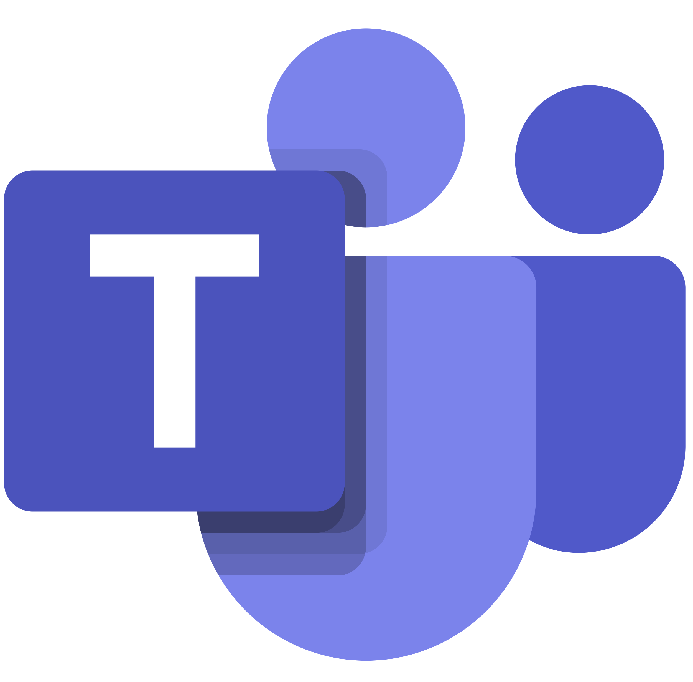

# Ferramentas

## Introdução 
Este documento tem como objetivo apresentar as ferramentas que serão utilizadas durante o projeto para organização, implementação e desenvolvimento do projeto durante todo o semestre letivo.

## Ferramentas
<table>
    <tr>
        <td align="center">Ícone</td>
        <td align="center">Ferramenta</td>
        <td align="center">Descrição</td>
    </tr>
    <tr>
        <td></td>
        <td style="vertical-align: middle;">Discord</td>
        <td style="vertical-align: middle;">Ferramenta utilizada para comunicação com o cliente e alinhamentos internos entre a equipe</td>
    </tr>
    <tr>
        <td></td>
        <td style="vertical-align: middle;">Figma</td>
        <td style="vertical-align: middle;">Ferramenta utilizada para prototipação das páginas do sistema e produção do Lean Inception da equipe</td>
    </tr>
    <tr>
        <td></td>
        <td style="vertical-align: middle;">Github</td>
        <td style="vertical-align: middle;">Ferramenta utilizada como repositório da documentação e códigos elaborados</td>
    </tr>
    <tr>
        <td></td>
        <td style="vertical-align: middle;">Teams</td>
        <td style="vertical-align: middle;">Ferramenta utilizada para a realização de reuniões semanais com o cliente</td>
    </tr>
    <tr>
        <td></td>
        <td style="vertical-align: middle;">Whatsapp</td>
        <td style="vertical-align: middle;">Ferramenta utilizada para comunicação interna entre os membros da equipe</td>
    </tr>
    <tr>
        <td></td>
        <td style="vertical-align: middle;">When2meet</td>
        <td style="vertical-align: middle;">Ferramenta que auxilia na produção de um heatmap com melhores horários de disponibilidade para agendamento de reuniões internas do time</td>
    </tr>
    <tr>
        <td></td>
        <td style="vertical-align: middle;">Zenhub</td>
        <td style="vertical-align: middle;">Ferramenta de gestão e organização do fluxo de tarefas do projeto</td>
    </tr>
</table>

## Histórico de Versão

Data|Autor(es)|Descrição|Versão
----|---------|--------------|--------
08/04/2024 | Adne Moretti | Criação do documento | 1.0
09/04/2024 | Brenno Oliveira | Formatação e complemento das ferramentas | 1.1