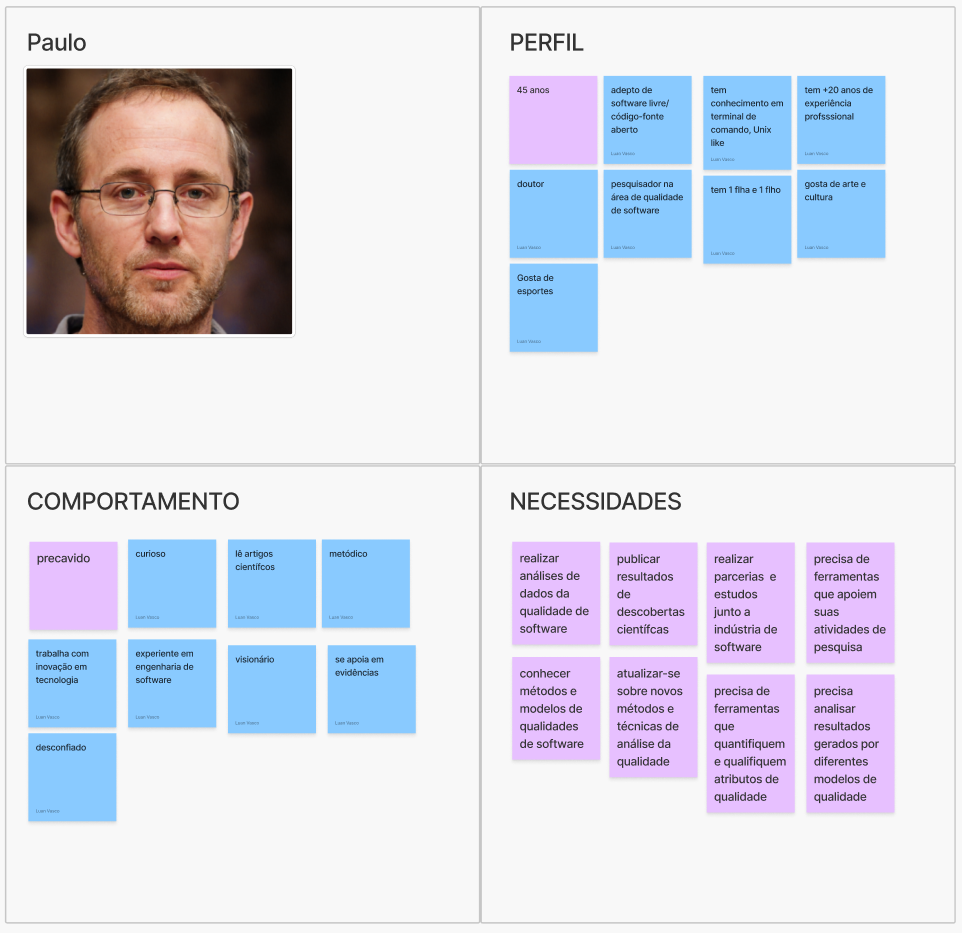
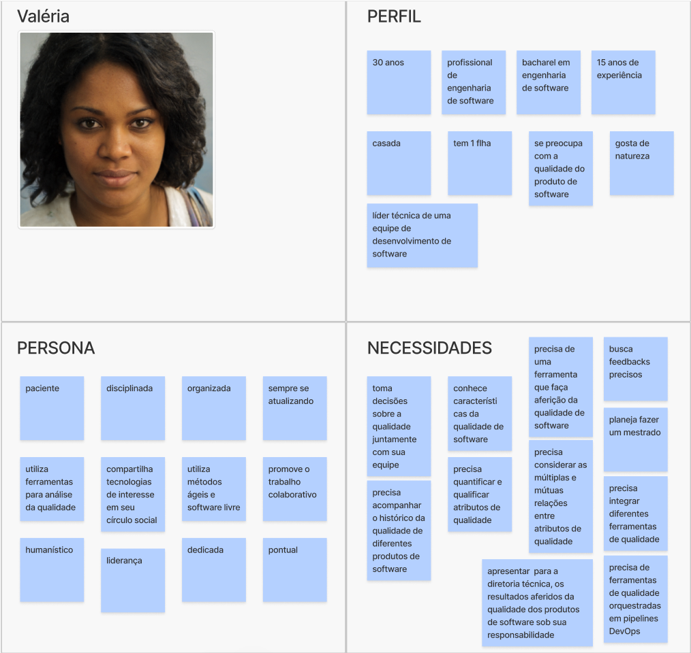
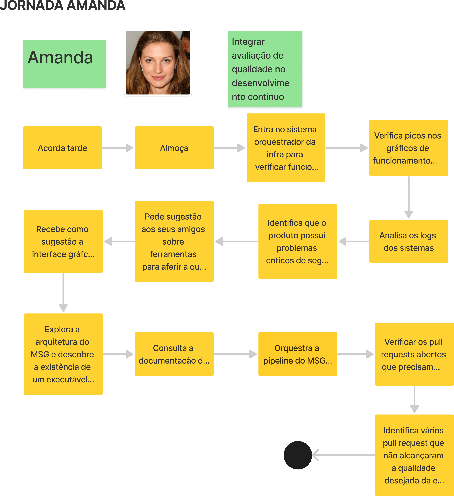
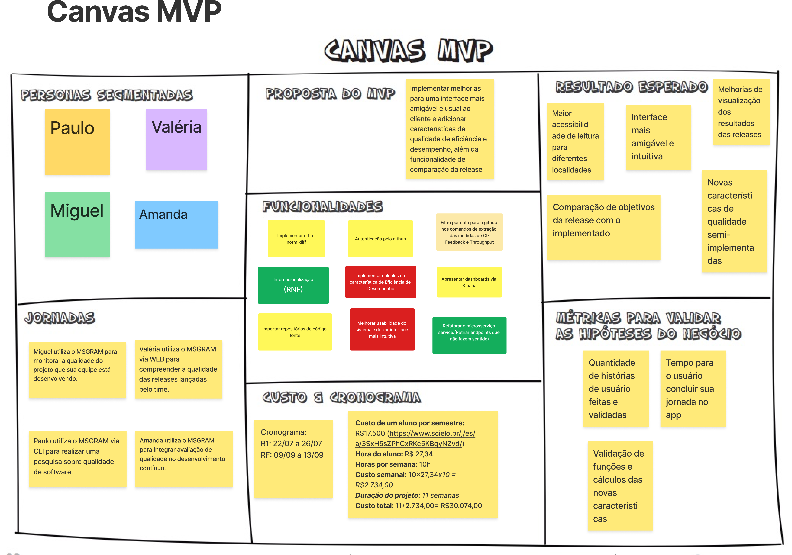

# Lean Inception do Projeto
## 1. Introdução
Lean Inception é uma metodologia colaborativa de uma semana para definir e alinhar a visão do Produto Mínimo Viável (MVP) de um software. Ela envolve atividades para entender as necessidades dos usuários, priorizar funcionalidades e criar um roadmap inicial. Essa metodologia foi popularizada por Paulo Caroli no livro "Lean Inception: How to Align People and Build the Right Product".

Este documento tem o objetivo de apresentar o resultado do Lean Inception que foi desenvolvido pelo grupo para o projeto MeasureSoftGram. O trabalho realizado tem como base o [Lean Inception desenvolvido no semestre anterior](https://fga-eps-mds.github.io/2023.2-MeasureSoftGram-DOC/lean_inception/) pelo outro grupo responsável pelo MeasureSoftGram.

## 2. Etapas da Lean Inception
### 2.1 Visão do Produto
A visão do produto é primeira etapa da Lean Inception, ela tem o objetivo de definir de forma clara e concisa a essência, o propósito, o diferencial e o valor de negócio do produto, sendo fundamental para orientar as próximas etapas.

A Visão de Produto do MeasureSoftGram:

### 2.2 O Produto É - NÃO É - FAZ - NÃO FAZ
O ENFN (É - Não é - Faz - Não faz) tem o objetivo de através de quatro perguntas definir características do produto tanto de forma positiva (é, faz), quanto de forma negativa (não é, não faz). Essa tarefa é fundamental para trazer uma visão mais clara sobre as características do desse produto.

O ENFN do MeasureSoftGram:

### 2.3 Objetivos do Produto
A definição dos objetivos do produto é fundamental as etapas seguintes, sendo um importante referencial para a compreensão do negócio. Nesta etapa é importante levantar vários pontos de vistas, discutir e definir os aspéctos relevantes para o entendimento dos objetivos do produto.

Objetivos do Produto MeasureSoftGram:

### 2.4 Personas
A definição de personas é importante para entender o produto a partir do entendimento dos usuários. Nesta etapa o grupo define quais são os perfis dos usuários do produto e listam características relevantes de cada perfil de usuário. A partir dessa definição, é possível analisar cada aspecto do produto levando em conta necessidades específicas de cada grupo de usuário.

As personas definidas para o MeasureSoftGram:

### 2.5 Jornadas do Usuário
A jornada do usuário é importante pra entender qual o caminho que aquele usuário vai percorrer durante o uso da aplicação. Nesta etapa, é definido o caminho do usuário levando em conta o perfil de cada um baseado nas personas definidas na etapa anterior.

A jornada dos usuários do MeasureSoftGram:

### 2.6 Brainstorm de Funcionalidades
O Brainstorm de Funcionalidades é útil para propor novas funcionalidades para o produto. Durante esta etapa, a equipe deve sugerir o máximo possível de funcionalidades, sem qualquer julgamentos em relação às ideias propostas, para que seja levantado os mais variados cenários possíveis.

O Brainstorm de Funcionalidades do MeasureSoftGram:

### 2.7 Revisão Técnica, de Negócio e de UX
Depois de identificar as funcionalidades, é necessário reavaliá-las, normalizá-las e eliminar aquelas que não são viáveis. Analisamos cada funcionalidade considerando o esforço, o valor para o negócio, a experiência dos usuários e o nível de confiança. O esforço, o valor para o negócio e o valor para a experiência do usuário são classificados em uma escala de um a três. O nível de confiança é classificado como baixo, médio ou alto, resultando em uma codificação por cores (vermelho, amarelo ou verde).

Revisão Técnica do MeasureSoftGram:

### 2.8 Sequenciador
O sequenciador é importante para priorizar as funcionalidades previamente identificadas e avaliadas. Para isso, o grupo deve organizar de forma sequencial as funcionalidades, de modo a indicar o que será implementado no MVP e o que será acrescentado posteriormente.

O Sequenciador do MeasureSoftGram:

### 2.9 Calculando Esforço, Tempo e Custo
O calculo de esforço é importante para o entendimento de quanto tempo durará a construção de cada onda e do MVP consequentemente.

Passos seguidos para as estimativas:
1 - Destrinchar as funcionalidades em pedaços menores (histórias de usuário);
2 - Dimensionar as histórias em tamanhos de esforço (P, M, G e GG);
3 - Estimar o tempo de 3 a 4 histórias em cada tamanho de esforço, em dias (1 dia = 1 jornada de trabalho = 8 horas);
4 - Fazer uma média de tempo de esforço para cada tamanho;
5 - Obter a média de tempo para cada onda.

As Estimativas do MeasureSoftGram:

### 2.10 Canvas MVP
O Canvas MVP é importante para definir o escopo do mínimo produto viável (MVP).O Canvas MVP é segmentado em sete blocos, cada um exigindo a resposta a uma pergunta específica, sendo elas:
1 - Proposta do MVP
2 - Personas segmentadas
3 - Jornadas
4 - Funcionalidades
5 - Resultado esperado
6 - Métricas para validar as hipóteses do negócio
7 - Custo e Cronograma

O Canvas MVP do MeasureSoftGram:

## 3. Lean Inception Completa

A Lean Inception Completa da equipe pode ser encontrada no Figma abaixo:

<iframe style="border: 1px solid rgba(0, 0, 0, 0.1);" width="800" height="450" src="https://www.figma.com/board/2NiX8V1jx1s6AGbbWErOuk/Visao-do-Produto-2024.1?node-id=0-1&t=pdAnMVHOTPkQuXp6-0" allowfullscreen></iframe>

## 4. Referências

> Paulo Caroli: Lean Inception: How to Align People and Build the Right Product. 1 ed. São Paulo.

## 5. Versionamento do Documento

| Data | Versão | Descrição | Autor |
| :-: | :-: | :-: | :-: |
| 01/08/2024 | 1.0 | Versão inicial completa do documento | [Thiago Siqueira Gomes](https://github.com/thgomes) |
